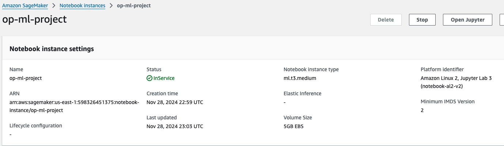
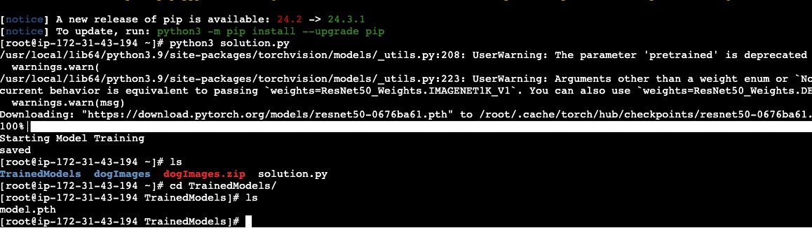
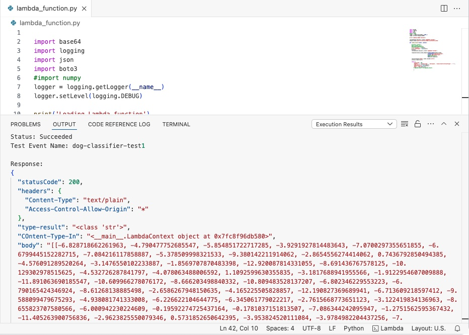
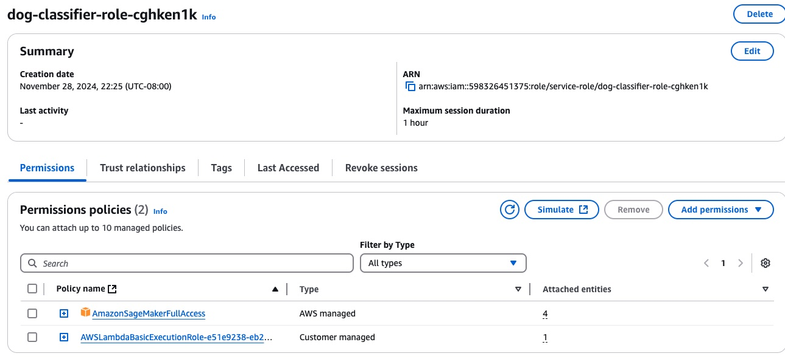
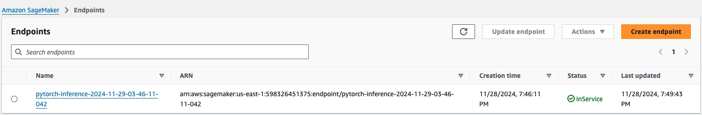
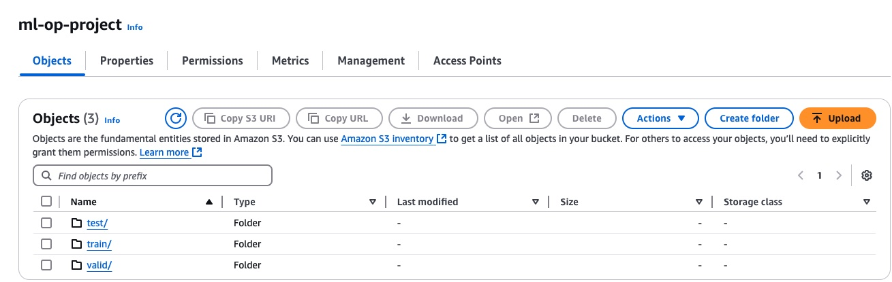

## Operationalizing Machine Learning on SageMaker

### 1. SageMaker Jupyter Notebook instance setup
I selected the instance type of ml.t3.medium, because this notebook itself would not lift heavy weights in calculation nor require large memory. The volume size of 5GB of EBS was selected, since it will only hold the dog image files of less than 2 GB.

### 2. EC2 set up
I used the instance type of m5.xlarge, which has 4vCPU and 16GB memory. For AMI, I selected Deep Learning AMI Neuron (Amazon Linux 2023). 

### 3. Difference between ec2train1.py and Jupyter notebook code
First of all ec2train1.py runs from EC2 instance itself, while Jupyter notebook code creates another instance and passes all the parameters to it. Secondly ec2train1.py run the modeling through assigning arguments to the functions, while  Jupyter notebook code runs the modeling through hpo.py script which parses the arguments in its `__main__` function. Thirdly ec2train1.py does not have the functionality of debugger nor profiler.

### 4. The content of the Lambda function
The lambda function does the liaison work between client and the predictor. It accepts an input from a client as "event" and checks its validity in file format; MIME type of "application/json". If the input passes this step, then the function proceed to decide the input to "utf-8" code, and then dumps it to json format, and returns it to the endpoint for prediction.

### 5. Lambda function test result

Response:  
{  
  "statusCode": 200,  
  "headers": {  
    "Content-Type": "text/plain",  
    "Access-Control-Allow-Origin": "*"  
  },  
  "type-result": "<class 'str'>",  
  "COntent-Type-In": "<__main__.LambdaContext object at 0x7fc8f96db580>",  
  "body": "[[-6.828718662261963, -4.790477752685547, -5.854851722717285, -3.9291927814483643, -7.0700297355651855, -6.6799445152282715, -7.084216117858887, -5.378509998321533, -9.380142211914062, -2.8654556274414062, 0.7436792850494385, -4.576091289520264, -3.1476550102233887, -1.8569707870483398, -12.920087814331055, -8.691436767578125, -10.129302978515625, -4.532726287841797, -4.078063488006592, 1.1092599630355835, -3.1817688941955566, -1.9122954607009888, -11.891063690185547, -10.609966278076172, -8.666203498840332, -10.809483528137207, -6.802346229553223, -6.790165424346924, -8.61268138885498, -2.6586267948150635, -4.165225505828857, -12.190827369689941, -6.713609218597412, -9.588099479675293, -4.938081741333008, -6.226622104644775, -6.345061779022217, -2.7615668773651123, -3.122419834136963, -8.655823707580566, -6.000942230224609, -0.19592274725437164, -0.1781037151813507, -7.086344242095947, -1.2751562595367432, -11.405263900756836, -2.9623825550079346, 0.5731852650642395, -3.953824520111084, -3.9784982204437256, -7.465721607208252, -8.135287284851074, -9.092424392700195, -5.531327724456787, -6.745800495147705, -0.7552616596221924, -7.136364936828613, -4.639416217803955, -5.972640514373779, -4.070411205291748, -8.636550903320312, -6.3731794357299805, -12.21915340423584, -10.86165714263916, -11.113222122192383, -8.321796417236328, -2.0956053733825684, -4.3808159828186035, -3.2566187381744385, -4.543034553527832, -2.382302761077881, -5.5844221115112305, -4.995497703552246, -4.9679155349731445, -2.6717958450317383, -1.7386434078216553, -10.702597618103027, -6.464200973510742, -5.405472755432129, -9.154412269592285, -2.7022335529327393, -11.521015167236328, 0.8381295800209045, -2.7210514545440674, -8.042720794677734, -6.759340763092041, -1.472829818725586, -11.306495666503906, -2.151543378829956, -3.075021982192993, -13.328850746154785, -6.985602855682373, -7.512771129608154, -5.6969194412231445, -5.46967887878418, -3.9569344520568848, -5.6079840660095215, -5.692257881164551, -9.26168441772461, -6.669890403747559, -11.557382583618164, -6.90941047668457, -5.136348724365234, -5.673098564147949, -8.679403305053711, -9.541876792907715, -2.8191187381744385, -2.315668821334839, -2.029010057449341, -3.2400052547454834, -2.739046573638916, -4.383666038513184, -10.970457077026367, -5.594115257263184, -7.2917704582214355, -2.443106174468994, -7.841568470001221, -2.503519296646118, -6.4891791343688965, -1.3266034126281738, -2.96732234954834, -6.804756164550781, -7.290592670440674, -6.870335578918457, -8.964890480041504, -9.776172637939453, -2.8133747577667236, -2.295407772064209, -8.283590316772461, -9.528170585632324, -4.670530796051025, -4.507363796234131, -3.1200413703918457]]"
}

### 6. Lambda function IAM
AmazonSageMakerFullAccess is too permissive. If I am on a real project, I would do some research to find out more restrictive permission for this role.

### 7. Concurrency and Auto-scaling
I set up the Lambda function's reserved concurrency as 100 maximum with 5 provisioned concurrency. Since the pre-initialized provisioned concurrency is more expensive, it is limited to 5 for an immediate response to a sudden increase in traffic.  
As for auto-scaling, I set up minimum instance count to 1 and maximum to 100 to answer a sudden increase of demands. The target value for invocations per instance was set at 10, which must be a reasonable value for this application. The scale in and out cool downs are set at 100 seconds for both to accommodate the change in traffic. 100 seconds will be enough to respond the traffic for both scale in and out cases.

### 8. Endpoint

### 9. S3 bucket

